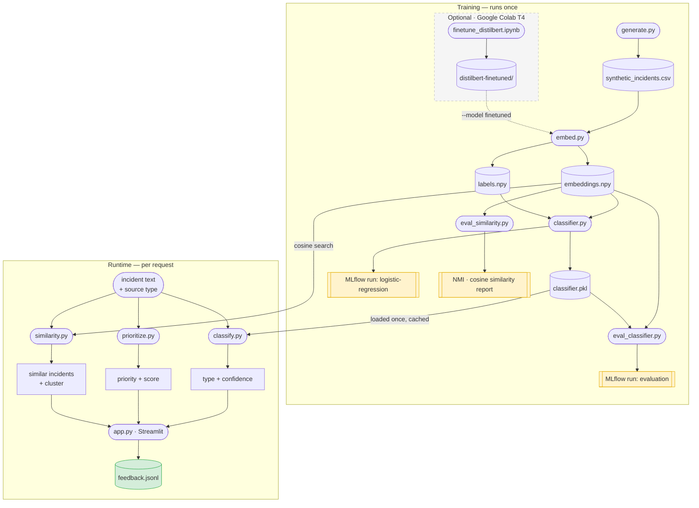

# ML-Based Incident Intelligence System

A transformer-backed prototype that ingests multi-source incident data, classifies each signal by incident type, scores its priority, detects similarity between signals, and merges correlated signals into a single incident report with a confidence score.

---

## The problem

Large organisations receive incident signals from multiple isolated systems simultaneously. A single real incident - an authentication service failure, for example - generates a ServiceNow ticket, a log entry, and a monitoring alert within minutes of each other. Without a system to correlate these signals, engineers treat each in isolation.

```
ServiceNow:  "Users cannot log in to VPN. Error: token validation failed"
Log:         "TokenValidationException: JWT expired at 2024-01-15 03:42:11"
Alert:       "auth_error_rate exceeded threshold 5% → 23% over 10min window"
```

These three signals describe the same incident. This system detects that.

---

## How it works - end to end



---

## Pipeline steps

The pipeline has a **training phase** (run once, produces artefacts) and a **runtime phase** (called live by the dashboard).

### Training phase

| Step | Script | Input | Output |
|------|--------|-------|--------|
| 1. Generate data | `src/data/generate.py` | - | `data/raw/synthetic_incidents.csv` |
| 2. Extract embeddings | `src/features/embed.py` | CSV | `embeddings.npy` (450 × 768), `labels.npy` |
| 3. Train classifier | `src/models/classifier.py` | embeddings | `models/classifier.pkl` |
| 4. Evaluate classifier | `src/evaluation/eval_classifier.py` | model + embeddings | metrics + confusion matrix PNG |
| 5. Evaluate similarity | `src/evaluation/eval_similarity.py` | embeddings | NMI + within/cross-group similarity |

Run all steps in order:

```bash
python train.py
```

Or individually:

```bash
python src/data/generate.py
python src/features/embed.py
python src/models/classifier.py
python src/evaluation/eval_classifier.py
python src/evaluation/eval_similarity.py
```

### Runtime phase (dashboard)

```bash
streamlit run src/dashboard/app.py
# open http://localhost:8501
```

---

## ML components

### 1. Classification - what kind of incident is this?

Each signal is classified into one of three types:

```
network_issue · authentication_failure · deployment_issue
```

**How:** DistilBERT converts raw text into a 768-dimensional embedding (a semantic fingerprint). A Logistic Regression trained on those embeddings draws boundaries between the three clusters in that space.

```
Text → DistilBERT [CLS] embedding → LogisticRegression → label + confidence
```

Expected: weighted F1 ≥ 0.98 on synthetic data (classes are semantically distinct).

### 2. Priority scoring - how urgent is it?

Priority is rule-based - no model is involved. Each signal's text is scored against two keyword sets:

```
HIGH keywords:   critical, outage, down, failed, fatal, crash, oom, unavailable
MEDIUM keywords: warning, slow, degraded, latency, timeout, retry, error
```

Source type adds a base floor (`alert` → medium, `ticket` / `log` → low).  
Final priority = whichever is higher: keyword match or source floor.

**Escalation:** if a cluster contains signals from ≥ 2 different source types (e.g. a ticket + an alert), all signals in that cluster are escalated to `high`. Corroborating evidence from multiple systems is treated as a stronger signal than any single source.

### 3. Similarity and correlation - are these signals about the same incident?

The same DistilBERT embeddings used for classification are reused directly - no second model is loaded.

Two signals are considered correlated if:

```
cosine_similarity(a, b) ≥ 0.80
AND |timestamp_a − timestamp_b| ≤ 3600 seconds
```

DBSCAN clusters all signals in one pass (`eps=0.20`, `min_samples=2`, cosine metric). The temporal constraint is baked into a custom distance function so both conditions are enforced simultaneously.

A fused incident report is produced for each cluster:

```
cluster_id:   3
type:         authentication_failure   (majority vote)
priority:     high                     (escalated - 3 source types present)
sources:      ticket · log · alert
signal_count: 3
confidence:   0.93                     (max pairwise cosine similarity)
```

---

## The embedding space - why fine-tuning matters

The base `distilbert-base-uncased` model produces embeddings where all IT-ops texts cluster together because they share vocabulary (`ERROR`, `ALERT:`, `failed`, `exceeded threshold`). This causes a near-zero discrimination gap:

```
Base model
  Within-group similarity:  0.93   ← signals from the same incident
  Cross-group similarity:   0.92   ← signals from different incidents
  Gap:                      0.01   ← almost no separation
```

After fine-tuning on the labeled 450 samples (done once on Google Colab T4, ~3 min):

```
Fine-tuned model
  Within-group similarity:  0.94   ← same incident, still close
  Cross-group similarity:  -0.04   ← different incidents now point in opposite directions
  Gap:                      0.97   ← 137× improvement
```

The dashboard has a sidebar toggle - **Base DistilBERT** vs **Fine-tuned DistilBERT** - that lets you observe the difference directly:

| Model | Clusters | Signals per cluster | Incident types mixed? |
|-------|----------|---------------------|-----------------------|
| Base DistilBERT | 50 | 9 (mixed) | Yes - all 3 types merged |
| Fine-tuned | ~150 | 3 | No - 1 type per cluster |

See [prototype.md](prototype.md) for the full fine-tuning walkthrough and how to reproduce it.

---

## Dashboard

Four tabs:

**Correlation Dashboard** - browse DBSCAN clusters sorted by priority. For each cluster: priority badge, incident type, confidence score, source types present, PCA scatter plot (selected cluster highlighted), raw signal texts, and an Accept / Reject feedback button.

**Analyze Incident** - live inference for a single new signal. Type any text, pick source type, and the system returns: incident type + confidence, per-class probability chart, priority badge, and the 8 most similar known signals.

**Dataset** - static view of all 450 synthetic rows with distribution charts by incident type, source type, and priority.

**Feedback Log** - audit trail of every analyst Accept / Reject decision. All feedback is persisted to `data/feedback.jsonl`.

---

## Experiment tracking (MLflow)

```bash
mlflow ui
# open http://127.0.0.1:5000
```

Every training and evaluation run is logged under the `incident-classifier` experiment. Each run stores hyperparameters, accuracy, weighted F1, per-class precision/recall, and artefacts (model + confusion matrix PNG). Use the Compare view to diff two runs side-by-side.

---

## Project structure

```
ml-based-incidents-intelligence-system/
├── data/
│   ├── raw/synthetic_incidents.csv       # 450 synthetic signals
│   ├── processed/
│   │   ├── embeddings.npy                # (450, 768) CLS vectors
│   │   ├── labels.npy                    # integer-encoded labels
│   │   └── confusion_matrix.png
│   └── feedback.jsonl                    # analyst decisions
├── models/
│   ├── classifier.pkl                    # trained LogisticRegression
│   └── distilbert-finetuned/             # fine-tuned backbone (optional)
├── src/
│   ├── data/generate.py
│   ├── features/embed.py
│   ├── models/classifier.py
│   ├── evaluation/
│   │   ├── eval_classifier.py
│   │   └── eval_similarity.py
│   ├── pipeline/
│   │   ├── classify.py
│   │   ├── prioritize.py
│   │   └── similarity.py
│   └── dashboard/app.py
├── research/
│   └── finetune_distilbert.ipynb         # Colab fine-tuning notebook
├── train.py                              # runs all 5 pipeline steps in order
├── requirements.txt
├── prototype.md                          # detailed walkthrough of every step
└── decisions-lessons.md                  # design decisions and lessons learned
```

---

## Quick start

```bash
pip install -r requirements.txt

# full pipeline
python train.py

# dashboard
streamlit run src/dashboard/app.py
```

First run downloads `distilbert-base-uncased` from HuggingFace (~250 MB, cached locally after that). Full pipeline runs on CPU in under 5 minutes.

---

## Success metrics

| Component | Target | What we see |
|-----------|--------|-------------|
| Classification weighted F1 | ≥ 0.85 | ≥ 0.98 |
| `classify_incident("Token validation failed")` | `authentication_failure` > 0.85 conf | ✓ |
| `score_priority("CRITICAL: auth service outage", "alert")` | `high` | ✓ |
| Within-group cosine similarity | ≥ 0.85 | 0.93 (base) / 0.94 (fine-tuned) |
| Cross-group cosine similarity | ≤ 0.50 | 0.92 (base) / **-0.04 (fine-tuned)** |
| NMI vs ground-truth groups | ≥ 0.80 | 0.88 |

---

## Going deeper

- **Step-by-step pipeline walkthrough, fine-tuning instructions, dashboard usage, known limitations and how they were addressed:** [prototype.md](docs/prototype.md)
- **Design decisions, lessons learned, and potential improvements:** [decisions-lessons.md](docs/decisions-lessons.md)
