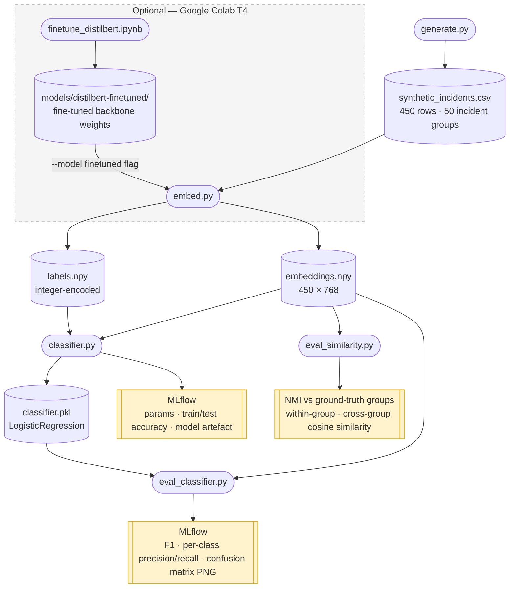
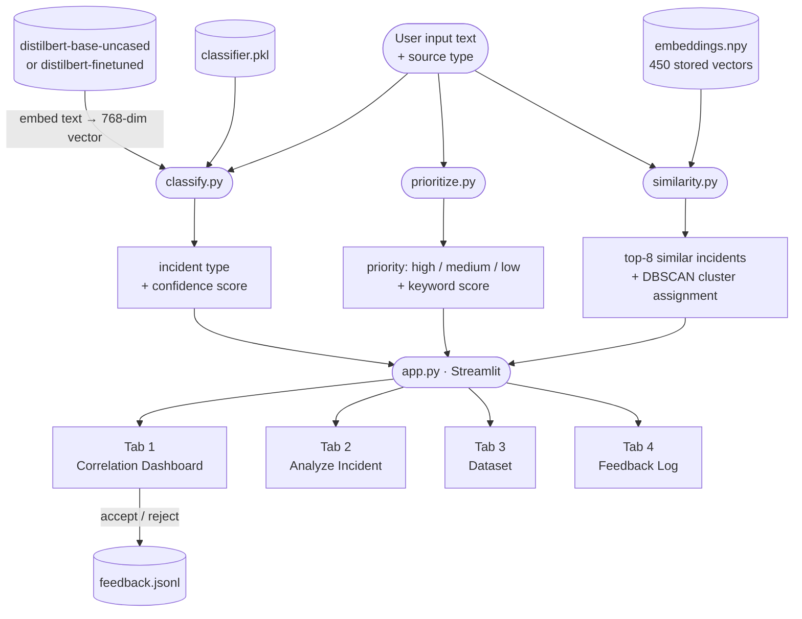
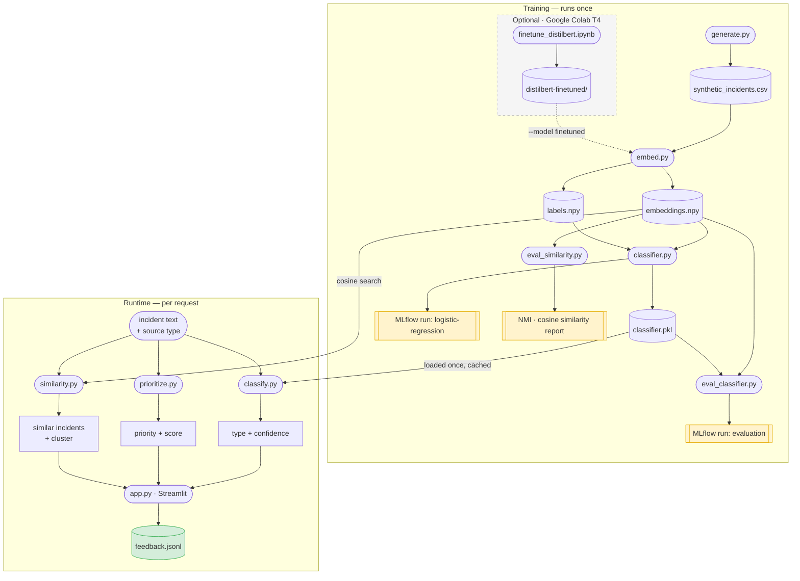

# Prototype Architecture

> Render with the [Markdown Preview Mermaid Support](https://marketplace.visualstudio.com/items?itemName=bierner.markdown-mermaid) VS Code extension, or push to GitHub — both render Mermaid natively.

---

## Training pipeline

Runs once. Each step produces a file the next step depends on.

---

## Runtime pipeline

Called live by the dashboard for each new signal or on page load.

---

## Full picture

Both pipelines together, showing how training artefacts feed the runtime layer.

